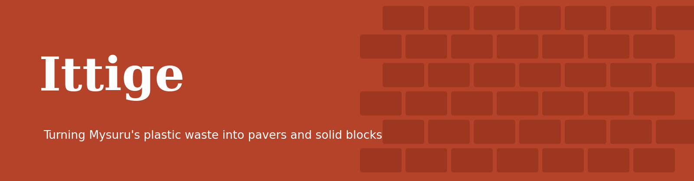
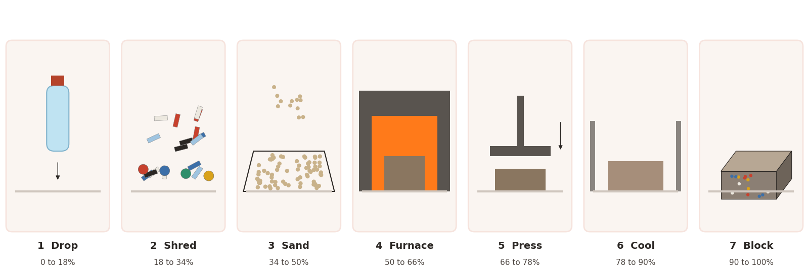
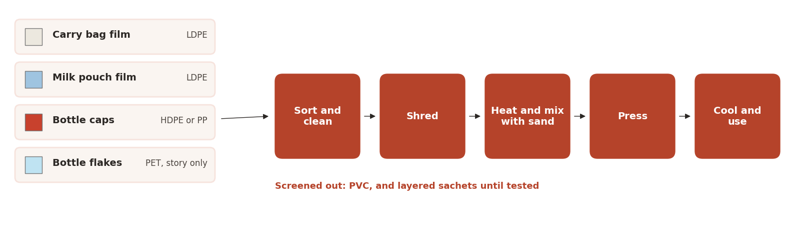
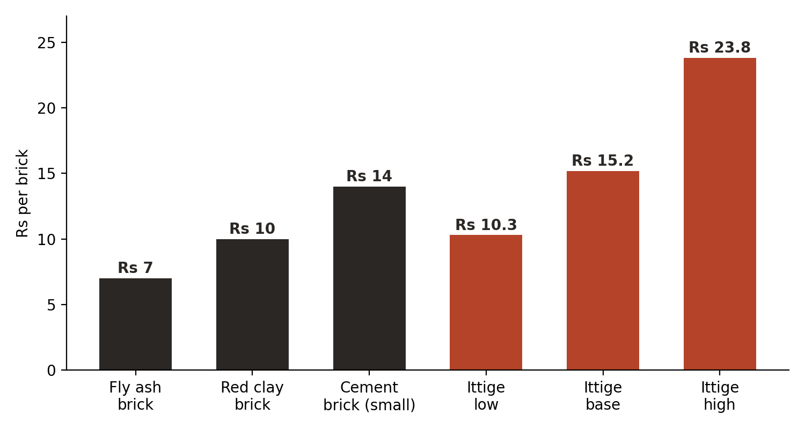

<div align="center">



<br>

<h3>A scroll-driven website that shows how low-value plastic waste becomes a building block</h3>

<p>
  
  
  
  
  
</p>

<p>
  <a href="https://ittige.vercel.app/"><b>Live site</b></a> &nbsp;|&nbsp;
  <a href="#about">About</a> &nbsp;|&nbsp;
  <a href="#the-animation">Animation</a> &nbsp;|&nbsp;
  <a href="#the-numbers">Numbers</a> &nbsp;|&nbsp;
  <a href="#getting-started">Getting started</a> &nbsp;|&nbsp;
  <a href="#deployment">Deployment</a> &nbsp;|&nbsp;
  <a href="#customising">Customising</a> &nbsp;|&nbsp;
  <a href="#team">Team</a>
</p>

<p>
  <a href="https://vercel.com/new/clone?repository-url=https%3A%2F%2Fgithub.com%2FAbhirai2006%2Fittige"></a>
</p>

</div>

<br>

## About

**Ittige** (Kannada for *brick*) is a social enterprise business plan for a small unit in Mysuru that turns low-value plastic packaging into pavers and solid blocks for compound walls. It was developed for the course *Management and Entrepreneurship* (21AI51) at the Mysore University School of Engineering.

This repository holds the project website, live at **[ittige.vercel.app](https://ittige.vercel.app/)**. It tells the story in four parts: the waste problem, how a block is made, the honest cost numbers, and the team. Every figure on the site is either cited in the accompanying report or labelled there as an assumption.

<div align="center">

| Problem | Idea | Honesty |
|:---:|:---:|:---:|
| About **550 tonnes** of solid waste a day in Mysuru | Melted plastic binds sand into a block, with no kiln or cement and no water in the mix (the film is washed first) | Ittige costs **Rs 10 to 24** per brick against about **Rs 10** for clay |

</div>

## Highlights

- **A block made live in your browser.** The scroll animation is drawn in WebGL from code, with no video and no image files.
- **Real plastic types.** Carry bag film, milk pouch film and bottle caps go into the mix, each named on screen with its plastic type.
- **Honest economics.** The price chart shows where Ittige loses to clay, and what would have to change for it to win.
- **A live cost calculator.** Visitors drag the price of plastic (even below zero, to see what a city payment would do) and watch the cost of one brick change against clay, fly ash and cement bricks. It runs the same model as the report, and the preset buttons reproduce the report's low, base and high cases.
- **Share card and icons.** A link pasted into WhatsApp or social media shows a preview card (`public/og.png`), and the browser tab has a brick icon (`app/icon.svg`).
- **Static and fast.** The site exports to plain files, so it deploys to Vercel with no server.
- **Hidden team links.** Each teammate's links appear only when a visitor hovers over or clicks the name.
- **Responsive.** The layout and the camera both adapt to phones, laptops and classroom projectors.

## The animation

<div align="center">

<p><sub>Schematic of the seven scroll stages. Drawn for this README; the live scene is rendered in 3D.</sub></p>
</div>

Scrolling moves a single progress value from 0 to 1, and the whole scene is a function of that value, so it plays forwards and backwards.

| Stage | Scroll | What happens | How it is modelled |
|:--|:--:|:--|:--|
| 1. Drop | 0 to 18% | A PET bottle falls and bounces once | Free fall under gravity with a bounce coefficient |
| 2. Shred | 18 to 34% | Film and caps fly out, bounce and settle in the mould | Projectile motion, bouncing, horizontal drag |
| 3. Sand | 34 to 50% | Sand grains pour in and pile up | Staggered drops with small bounces |
| 4. Furnace | 50 to 66% | The mould slides into a glowing furnace and the plastic melts | Eased motion, colour and glow blend |
| 5. Press | 66 to 78% | A plate compresses the hot mix | Damped spring, with a small rebound |
| 6. Cool | 78 to 90% | The mould opens and the block cools | Emissive glow fades out |
| 7. Block | 90 to 100% | The finished block lifts and spins | Eased rotation, then a slow idle spin |

**Materials shown in the mix**

| Material | Plastic type | Note |
|:--|:--:|:--|
| Carry bag film | LDPE | Main feed |
| Milk pouch film | LDPE | Main feed |
| Bottle caps | HDPE or PP | Small, sorted share |
| A few bottle flakes | PET | Story only. Bottles are not the real input |
| *Not used* | PVC | Screened out at sorting |
| *Not used* | Layered sachets | Kept out until tested |

The bottle is kept as the opening image because everyone recognises it, but the real plan uses other plastic: PET bottles already have a collection market, and studies disagree on whether PET or LDPE is stronger with sand.

<div align="center">

</div>

Technical notes:

- The falling and bouncing use closed-form equations, so any scroll position can be computed directly without stepping a simulation.
- Random values are seeded, so the scene looks the same on every visit.
- The brick surface texture is generated on a canvas at load time. The repository contains no image assets for the scene.
- Flakes, caps and sand use instanced meshes, so about 550 pieces cost very little to draw.
- The pixel ratio is capped at 2 to keep phones smooth.
- The camera distance adapts to screen shape, so the mould stays in frame on narrow screens and the furnace stays in frame on wide and 4:3 screens.
- The animation canvas carries a text description that updates with each step, and the caption is announced politely to screen readers.
- The stat counters start at their final values, so a print or preview never shows zeros. The count-up only plays when a counter scrolls into view, and not at all for visitors who prefer reduced motion.

## The numbers

<div align="center">

</div>

The model is a one-tonne-a-day pilot unit with three cases that differ mainly in the price paid for plastic.

| Case | Plastic price | Cost per brick |
|:--|:--:|:--:|
| Low | Rs 0 per kg | Rs 10.3 |
| Base | Rs 5 per kg | Rs 15.2 |
| High | Rs 14 per kg | Rs 23.8 |

A red clay brick in Mysuru is listed at about Rs 10. Ittige matches clay only if plastic is nearly free, or if the city pays about 75 paise per kg to have sorted plastic taken. Labour, power, transport and overhead are labelled assumptions in the report. The full working, sources and limits are in the accompanying report.

## Tech stack

<div align="center">

| Layer | Choice |
|:---:|:---:|
| Framework | Next.js 14 (App Router, static export) |
| UI | React 18 |
| 3D | Three.js (plain WebGL, no extra wrappers) |
| Styling | Plain CSS, system fonts |
| Hosting | Vercel |

</div>

## Getting started

**Requirements:** Node.js 18.17 or newer, and a browser with WebGL.

```bash
git clone https://github.com/Abhirai2006/ittige.git
cd ittige
npm install
npm run dev
```

Open <http://localhost:3000>. To produce the static site:

```bash
npm run build      # writes the site to the out/ folder
```

## Deployment

Import the repository on [vercel.com](https://vercel.com/new). No settings are needed, because Vercel detects Next.js automatically. Every push to the main branch redeploys the site.

## Project structure

```text
ittige/
├── app/
│   ├── layout.jsx          page metadata
│   ├── page.jsx            sections: hero, problem, numbers, calculator, team
│   ├── globals.css         styles and reveal animations
│   ├── icon.svg            browser tab icon
│   └── apple-icon.png      iPhone home screen icon
├── components/
│   ├── BrickScene.jsx      the scroll-driven 3D animation
│   └── Calculator.jsx      the live cost calculator
├── lib/
│   └── model.js            the pilot cost model (same as the report)
├── docs/                   images used by this README
├── public/og.png           share preview image (1200 x 630)
└── next.config.js          static export settings
```

## Customising

- **Team names, USNs and links:** edit the `TEAM` list at the top of `app/page.jsx`. Names and USNs are always shown. A member's GitHub, LinkedIn and portfolio links stay hidden until a visitor hovers over or clicks the name. A member with an empty `links` list shows no links.
- **Calculator assumptions:** the clay price, daily costs and brick weight are constants at the top of `lib/model.js`. Change them there if the report changes.
- **Animation captions and the materials legend:** edit `CAP` and `MATS` in `components/BrickScene.jsx`.
- **Numbers and text:** edit `app/page.jsx`. If the report changes, update the page to match.
- **Colours:** change the variables at the top of `app/globals.css`.

## Team

<div align="center">

| Name | USN |
|:---:|:---:|
| Abhishek Rai A | 24SEAI003 |
| Akshay S Bharadwaj | 24SEAI005 |
| Faabid Faizal | 24SEAI026 |
| Nirmitha D | 24SEAI051 |

Department of Artificial Intelligence and Machine Learning
Mysore University School of Engineering, Mysuru

</div>

## Notes on the content

Ittige is an academic business plan. Figures come from published sources listed in the report, and prices come from marketplace listings and price trackers, which are indicative only. The brick in the animation is a computer-drawn illustration, not a photograph of a tested product. No strength, fire or safety tests have been run, and the plan states this openly.

<div align="center">
<br>
<sub>Built with Next.js and Three.js</sub>
</div>

## Motion and effects

- A progress bar at the top shows how far down the page you are.
- The hero title letters pop in one by one, with floating sticker tags and a scrolling facts ticker below it.
- Cards tilt towards the pointer with a soft glare, and a faint glow follows the cursor on desktop.
- Section headings draw an underline when they scroll into view, and the chart bars carry a moving shine.
- In the calculator, the cost number pops on every change, and a burst of brick-shaped confetti fires when your settings bring an Ittige brick down to the price of clay.
- Pointer effects are switched off on touch screens, and every animation stops for visitors who ask their device for reduced motion.
